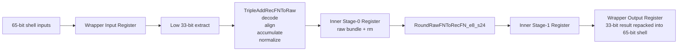
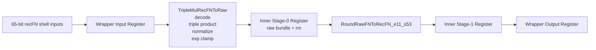
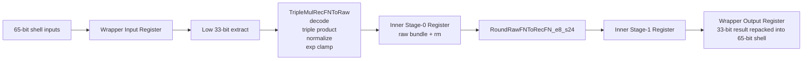
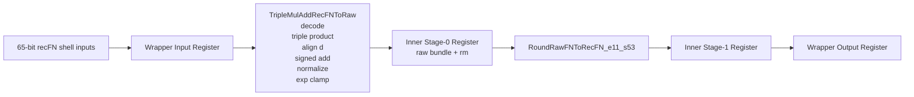
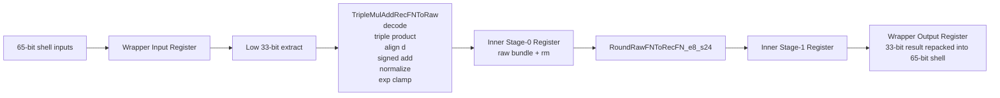

# Triple-FP Block Diagrams

This document collects the top-level block diagrams for the implemented units in one place.

The same diagrams are mirrored in [README.md](/Users/kvsaiakhil/Projects/BoomV3/triple_fp_units/README.md).

## `TripleAddPipe_l4_f64`

## `TripleAddPipe_l4_f32`

## `TripleMulPipe_l4_f64`

## `TripleMulPipe_l4_f32`

## `TripleMulAddPipe_l4_f64`

## `TripleMulAddPipe_l4_f32`

## Reading Notes

- `f64` units operate directly on 65-bit recFN inputs and outputs.
- `f32` units use the BOOM-style 65-bit shell externally, but the active datapath is the low 33 bits.
- all six units preserve the same visible 4-stage interface shape as the original FMA wrappers.
