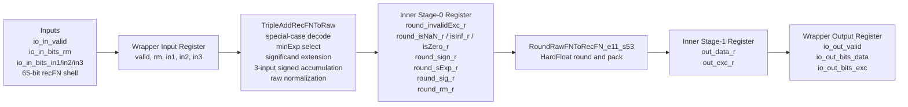
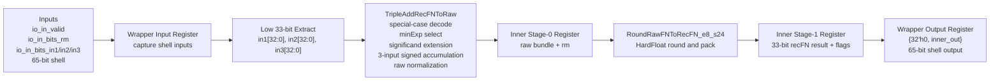
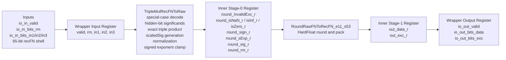
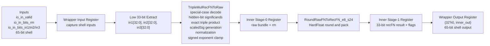

# Triple FP Units

Standalone triple-operand floating-point units built in the BOOM/HardFloat RTL environment.

This project implements:

- triple add: `a + b + c`
- triple multiply: `a * b * c`
- single precision (`f32`)
- double precision (`f64`)

These are standalone pipelined RTL blocks. They are not integrated into BOOM decode/issue/writeback.

## What Is In This Repo

Implemented top-level units:

- [TripleAddPipe_l4_f64.sv](/Users/kvsaiakhil/Projects/BoomV3/triple_fp_units/TripleAddPipe_l4_f64.sv)
- [TripleAddPipe_l4_f32.sv](/Users/kvsaiakhil/Projects/BoomV3/triple_fp_units/TripleAddPipe_l4_f32.sv)
- [TripleMulPipe_l4_f64.sv](/Users/kvsaiakhil/Projects/BoomV3/triple_fp_units/TripleMulPipe_l4_f64.sv)
- [TripleMulPipe_l4_f32.sv](/Users/kvsaiakhil/Projects/BoomV3/triple_fp_units/TripleMulPipe_l4_f32.sv)

Shared inner pipes:

- [TripleAddRecFNPipe_l2.sv](/Users/kvsaiakhil/Projects/BoomV3/triple_fp_units/TripleAddRecFNPipe_l2.sv)
- [TripleMulRecFNPipe_l2.sv](/Users/kvsaiakhil/Projects/BoomV3/triple_fp_units/TripleMulRecFNPipe_l2.sv)

Raw arithmetic cores:

- [TripleAddRecFNToRaw.sv](/Users/kvsaiakhil/Projects/BoomV3/triple_fp_units/TripleAddRecFNToRaw.sv)
- [TripleMulRecFNToRaw.sv](/Users/kvsaiakhil/Projects/BoomV3/triple_fp_units/TripleMulRecFNToRaw.sv)

Project navigation:

- full project landing page: [PROJECT_SUMMARY.md](/Users/kvsaiakhil/Projects/BoomV3/triple_fp_units/PROJECT_SUMMARY.md)
- main design spec: [TRIPLE_FP_UNITS_SPEC.md](/Users/kvsaiakhil/Projects/BoomV3/triple_fp_units/TRIPLE_FP_UNITS_SPEC.md)
- verification summary: [OFFLINE_VERIFICATION.md](/Users/kvsaiakhil/Projects/BoomV3/triple_fp_units/OFFLINE_VERIFICATION.md)
- diagrams-only page: [BLOCK_DIAGRAMS.md](/Users/kvsaiakhil/Projects/BoomV3/triple_fp_units/BLOCK_DIAGRAMS.md)

## Design Goals

- keep the interface and visible latency aligned with the original FMA wrapper style
- reuse the existing recFN and HardFloat rounder environment already present in BOOM/Chipyard RTL
- provide strong standalone verification
- provide readable software reference models for learning and debugging

## Pipeline Shape

All four units follow the same visible registered structure:

1. wrapper input register
2. inner pipe stage 0 register
3. inner pipe stage 1 register
4. wrapper output register

For `f64`, the active recFN datapath width is 65 bits.

For `f32`, the external wrapper still uses a 65-bit BOOM-style shell, but the active recFN value is the low 33 bits inside the unit.

## Unit Summary

| Unit | Operation | Precision | External Input | Internal recFN | Rounder |
|---|---|---|---|---|---|
| `TripleAddPipe_l4_f64` | `a+b+c` | `f64` | 65-bit shell | 65-bit recFN | `RoundRawFNToRecFN_e11_s53` |
| `TripleAddPipe_l4_f32` | `a+b+c` | `f32` | 65-bit shell | low 33 bits active | `RoundRawFNToRecFN_e8_s24` |
| `TripleMulPipe_l4_f64` | `a*b*c` | `f64` | 65-bit shell | 65-bit recFN | `RoundRawFNToRecFN_e11_s53` |
| `TripleMulPipe_l4_f32` | `a*b*c` | `f32` | 65-bit shell | low 33 bits active | `RoundRawFNToRecFN_e8_s24` |

## Block Diagrams

### `TripleAddPipe_l4_f64`



### `TripleAddPipe_l4_f32`



### `TripleMulPipe_l4_f64`



### `TripleMulPipe_l4_f32`



## Arithmetic Breakdown

### Triple add path

The add units perform:

1. recFN operand classification
2. special-case handling for NaN, infinity, and zero
3. finite exponent alignment using the minimum recoded exponent
4. 3-input signed accumulation in a wide exact accumulator
5. raw normalization into the HardFloat rounder contract
6. final rounding and recFN packing

### Triple multiply path

The multiply units perform:

1. recFN operand classification
2. special-case handling for NaN, infinity, zero, and `inf * 0`
3. hidden-bit significand formation
4. exact 3-input significand product
5. recoded-exponent accumulation
6. raw normalization and exponent clamp
7. final rounding and recFN packing

## Verification

Directed standalone benches:

- [tb_triple_fp_f64.sv](/Users/kvsaiakhil/Projects/BoomV3/triple_fp_units/tb_triple_fp_f64.sv)
- [tb_triple_fp_f32.sv](/Users/kvsaiakhil/Projects/BoomV3/triple_fp_units/tb_triple_fp_f32.sv)

Deep vector-driven verification:

- [verif/README.md](/Users/kvsaiakhil/Projects/BoomV3/triple_fp_units/verif/README.md)
- [verif/generate_triple_fp_vectors.py](/Users/kvsaiakhil/Projects/BoomV3/triple_fp_units/verif/generate_triple_fp_vectors.py)
- [verif/tb_triple_fp_random_f64.sv](/Users/kvsaiakhil/Projects/BoomV3/triple_fp_units/verif/tb_triple_fp_random_f64.sv)
- [verif/tb_triple_fp_random_f32.sv](/Users/kvsaiakhil/Projects/BoomV3/triple_fp_units/verif/tb_triple_fp_random_f32.sv)

Reusable UVM-lite environment:

- [uvm_lite/README.md](/Users/kvsaiakhil/Projects/BoomV3/triple_fp_units/uvm_lite/README.md)
- [uvm_lite/triple_fp_uvm_lite_env.sv](/Users/kvsaiakhil/Projects/BoomV3/triple_fp_units/uvm_lite/triple_fp_uvm_lite_env.sv)
- [uvm_lite/triple_fp_uvm_lite_cov.sv](/Users/kvsaiakhil/Projects/BoomV3/triple_fp_units/uvm_lite/triple_fp_uvm_lite_cov.sv)
- [uvm_lite/run_uvm_lite_verilator.sh](/Users/kvsaiakhil/Projects/BoomV3/triple_fp_units/uvm_lite/run_uvm_lite_verilator.sh)

Latest verified status is summarized in [OFFLINE_VERIFICATION.md](/Users/kvsaiakhil/Projects/BoomV3/triple_fp_units/OFFLINE_VERIFICATION.md).

## Tool Installation

### Required local tools

For the verification flows used in this project, install:

- `verilator`
- `svlint`
- `python3`

On macOS with Homebrew:

```sh
brew install verilator svlint python
```

### Optional tools

These are optional, depending on how deep you want to go:

- `iverilog`
  useful for alternate lightweight simulation
- full commercial simulator such as Questa, VCS, or Xcelium
  useful if you want functional coverage collection from the UVM-lite environment

## Environment Setup

The commands below assume your workspace is:

```sh
/Users/kvsaiakhil/Projects/BoomV3
```

The project root for this subproject is:

```sh
/Users/kvsaiakhil/Projects/BoomV3/triple_fp_units
```

For convenience:

```sh
cd /Users/kvsaiakhil/Projects/BoomV3/triple_fp_units
```

## How To Run And Verify

There are three useful verification levels:

1. directed standalone benches
2. deep vector-based random replay
3. structured UVM-lite replay

There is also a fourth learning/debug path:

4. Python staged reference/debug models

### 1. Directed standalone benches

These benches verify both add and multiply together for each precision.

#### `f64` standalone bench

```sh
verilator --binary --timing -Wall -Wno-fatal -Wno-UNUSEDSIGNAL \
  /Users/kvsaiakhil/Projects/BoomV3/triple_fp_units/tb_triple_fp_f64.sv \
  /Users/kvsaiakhil/Projects/BoomV3/triple_fp_units/TripleAddPipe_l4_f64.sv \
  /Users/kvsaiakhil/Projects/BoomV3/triple_fp_units/TripleAddRecFNPipe_l2.sv \
  /Users/kvsaiakhil/Projects/BoomV3/triple_fp_units/TripleAddRecFNToRaw.sv \
  /Users/kvsaiakhil/Projects/BoomV3/triple_fp_units/TripleMulPipe_l4_f64.sv \
  /Users/kvsaiakhil/Projects/BoomV3/triple_fp_units/TripleMulRecFNPipe_l2.sv \
  /Users/kvsaiakhil/Projects/BoomV3/triple_fp_units/TripleMulRecFNToRaw.sv \
  /Users/kvsaiakhil/Projects/BoomV3/INToRecFN_i64_e11_s53.sv \
  /Users/kvsaiakhil/Projects/BoomV3/RoundRawFNToRecFN_e11_s53.sv \
  /Users/kvsaiakhil/Projects/BoomV3/RoundAnyRawFNToRecFN_ie11_is55_oe11_os53.sv \
  /Users/kvsaiakhil/Projects/BoomV3/RoundAnyRawFNToRecFN_ie7_is64_oe11_os53.sv
/Users/kvsaiakhil/Projects/BoomV3/obj_dir/Vtb_triple_fp_f64
```

Expected result:

- `tb_triple_fp_f64 PASS`

#### `f32` standalone bench

```sh
verilator --binary --timing -Wall -Wno-fatal -Wno-UNUSEDSIGNAL \
  /Users/kvsaiakhil/Projects/BoomV3/triple_fp_units/tb_triple_fp_f32.sv \
  /Users/kvsaiakhil/Projects/BoomV3/triple_fp_units/TripleAddPipe_l4_f32.sv \
  /Users/kvsaiakhil/Projects/BoomV3/triple_fp_units/TripleAddRecFNPipe_l2.sv \
  /Users/kvsaiakhil/Projects/BoomV3/triple_fp_units/TripleAddRecFNToRaw.sv \
  /Users/kvsaiakhil/Projects/BoomV3/triple_fp_units/TripleMulPipe_l4_f32.sv \
  /Users/kvsaiakhil/Projects/BoomV3/triple_fp_units/TripleMulRecFNPipe_l2.sv \
  /Users/kvsaiakhil/Projects/BoomV3/triple_fp_units/TripleMulRecFNToRaw.sv \
  /Users/kvsaiakhil/Projects/BoomV3/INToRecFN_i64_e8_s24.sv \
  /Users/kvsaiakhil/Projects/BoomV3/RoundRawFNToRecFN_e8_s24.sv \
  /Users/kvsaiakhil/Projects/BoomV3/RoundAnyRawFNToRecFN_ie8_is26_oe8_os24.sv \
  /Users/kvsaiakhil/Projects/BoomV3/RoundAnyRawFNToRecFN_ie7_is64_oe8_os24.sv
/Users/kvsaiakhil/Projects/BoomV3/obj_dir/Vtb_triple_fp_f32
```

Expected result:

- `tb_triple_fp_f32 PASS`

### 2. Deep vector-based verification

This flow uses the larger vector corpus in `verif/vectors/`.

If you want to regenerate vectors:

```sh
python3 /Users/kvsaiakhil/Projects/BoomV3/triple_fp_units/verif/generate_triple_fp_vectors.py --n-per-seed 128
```

#### `f64` deep replay

```sh
verilator --binary --timing -Wall -Wno-fatal -Wno-UNUSEDSIGNAL \
  /Users/kvsaiakhil/Projects/BoomV3/triple_fp_units/verif/tb_triple_fp_random_f64.sv \
  /Users/kvsaiakhil/Projects/BoomV3/triple_fp_units/TripleAddPipe_l4_f64.sv \
  /Users/kvsaiakhil/Projects/BoomV3/triple_fp_units/TripleAddRecFNPipe_l2.sv \
  /Users/kvsaiakhil/Projects/BoomV3/triple_fp_units/TripleAddRecFNToRaw.sv \
  /Users/kvsaiakhil/Projects/BoomV3/triple_fp_units/TripleMulPipe_l4_f64.sv \
  /Users/kvsaiakhil/Projects/BoomV3/triple_fp_units/TripleMulRecFNPipe_l2.sv \
  /Users/kvsaiakhil/Projects/BoomV3/triple_fp_units/TripleMulRecFNToRaw.sv \
  /Users/kvsaiakhil/Projects/BoomV3/RoundRawFNToRecFN_e11_s53.sv \
  /Users/kvsaiakhil/Projects/BoomV3/RoundAnyRawFNToRecFN_ie11_is55_oe11_os53.sv
/Users/kvsaiakhil/Projects/BoomV3/obj_dir/Vtb_triple_fp_random_f64
```

Expected result:

- `tb_triple_fp_random_f64 PASS (...)`

#### `f32` deep replay

```sh
verilator --binary --timing -Wall -Wno-fatal -Wno-UNUSEDSIGNAL \
  /Users/kvsaiakhil/Projects/BoomV3/triple_fp_units/verif/tb_triple_fp_random_f32.sv \
  /Users/kvsaiakhil/Projects/BoomV3/triple_fp_units/TripleAddPipe_l4_f32.sv \
  /Users/kvsaiakhil/Projects/BoomV3/triple_fp_units/TripleAddRecFNPipe_l2.sv \
  /Users/kvsaiakhil/Projects/BoomV3/triple_fp_units/TripleAddRecFNToRaw.sv \
  /Users/kvsaiakhil/Projects/BoomV3/triple_fp_units/TripleMulPipe_l4_f32.sv \
  /Users/kvsaiakhil/Projects/BoomV3/triple_fp_units/TripleMulRecFNPipe_l2.sv \
  /Users/kvsaiakhil/Projects/BoomV3/triple_fp_units/TripleMulRecFNToRaw.sv \
  /Users/kvsaiakhil/Projects/BoomV3/RoundRawFNToRecFN_e8_s24.sv \
  /Users/kvsaiakhil/Projects/BoomV3/RoundAnyRawFNToRecFN_ie8_is26_oe8_os24.sv
/Users/kvsaiakhil/Projects/BoomV3/obj_dir/Vtb_triple_fp_random_f32
```

Expected result:

- `tb_triple_fp_random_f32 PASS (...)`

### 3. UVM-lite structured replay

This is the most reusable verification harness in the project.

Run both precisions:

```sh
/Users/kvsaiakhil/Projects/BoomV3/triple_fp_units/uvm_lite/run_uvm_lite_verilator.sh all
```

Run only `f64`:

```sh
/Users/kvsaiakhil/Projects/BoomV3/triple_fp_units/uvm_lite/run_uvm_lite_verilator.sh f64
```

Run only `f32`:

```sh
/Users/kvsaiakhil/Projects/BoomV3/triple_fp_units/uvm_lite/run_uvm_lite_verilator.sh f32
```

Expected results:

- `uvm_lite precision=64 PASS total=73272 add=36636 mul=36636`
- `uvm_lite precision=32 PASS total=73236 add=36618 mul=36618`

Note:

- under Verilator, covergroups are intentionally disabled
- under Questa, VCS, or Xcelium, the same UVM-lite environment can collect functional coverage

### 4. Python staged reference/debug models

These models are best for understanding each unit rather than replacing RTL simulation.

#### Triple add, `f64`

```sh
python3 /Users/kvsaiakhil/Projects/BoomV3/triple_fp_units/python_reference_models/run_reference_model.py \
  --unit triple_add_f64 \
  --input-format ieee \
  --rm rne \
  --a 0x3ff0000000000000 \
  --b 0x4000000000000000 \
  --c 0x4008000000000000
```

#### Triple add, `f32`

```sh
python3 /Users/kvsaiakhil/Projects/BoomV3/triple_fp_units/python_reference_models/run_reference_model.py \
  --unit triple_add_f32 \
  --input-format ieee \
  --rm rne \
  --a 0x3f800000 \
  --b 0x40000000 \
  --c 0x40400000
```

#### Triple multiply, `f64`

```sh
python3 /Users/kvsaiakhil/Projects/BoomV3/triple_fp_units/python_reference_models/run_reference_model.py \
  --unit triple_mul_f64 \
  --input-format ieee \
  --rm rne \
  --a 0x3ff0000000000000 \
  --b 0x4000000000000000 \
  --c 0x4008000000000000
```

#### Triple multiply, `f32`

```sh
python3 /Users/kvsaiakhil/Projects/BoomV3/triple_fp_units/python_reference_models/run_reference_model.py \
  --unit triple_mul_f32 \
  --input-format ieee \
  --rm rne \
  --a 0x3f800000 \
  --b 0x40000000 \
  --c 0x40400000
```

This prints:

- operand recFN breakdown
- per-stage intermediate values
- final output recFN value
- final exception flags

### Python model sanity check

To sanity-check the Python reference layer against sampled existing vectors:

```sh
python3 /Users/kvsaiakhil/Projects/BoomV3/triple_fp_units/python_reference_models/test_reference_models.py
```

Expected result:

- `triple_add_f64: PASS (32 sampled vectors)`
- `triple_mul_f64: PASS (32 sampled vectors)`
- `triple_add_f32: PASS (32 sampled vectors)`
- `triple_mul_f32: PASS (32 sampled vectors)`

## How To Verify Each Implementation

### `TripleAddPipe_l4_f64`

Use one or more of:

- directed `f64` bench: [tb_triple_fp_f64.sv](/Users/kvsaiakhil/Projects/BoomV3/triple_fp_units/tb_triple_fp_f64.sv)
- deep `f64` replay: [verif/tb_triple_fp_random_f64.sv](/Users/kvsaiakhil/Projects/BoomV3/triple_fp_units/verif/tb_triple_fp_random_f64.sv)
- UVM-lite `f64`: [uvm_lite/tb_triple_fp_uvm_lite_f64.sv](/Users/kvsaiakhil/Projects/BoomV3/triple_fp_units/uvm_lite/tb_triple_fp_uvm_lite_f64.sv)
- Python model: `--unit triple_add_f64`

### `TripleMulPipe_l4_f64`

Use one or more of:

- directed `f64` bench: [tb_triple_fp_f64.sv](/Users/kvsaiakhil/Projects/BoomV3/triple_fp_units/tb_triple_fp_f64.sv)
- deep `f64` replay: [verif/tb_triple_fp_random_f64.sv](/Users/kvsaiakhil/Projects/BoomV3/triple_fp_units/verif/tb_triple_fp_random_f64.sv)
- UVM-lite `f64`: [uvm_lite/tb_triple_fp_uvm_lite_f64.sv](/Users/kvsaiakhil/Projects/BoomV3/triple_fp_units/uvm_lite/tb_triple_fp_uvm_lite_f64.sv)
- Python model: `--unit triple_mul_f64`

### `TripleAddPipe_l4_f32`

Use one or more of:

- directed `f32` bench: [tb_triple_fp_f32.sv](/Users/kvsaiakhil/Projects/BoomV3/triple_fp_units/tb_triple_fp_f32.sv)
- deep `f32` replay: [verif/tb_triple_fp_random_f32.sv](/Users/kvsaiakhil/Projects/BoomV3/triple_fp_units/verif/tb_triple_fp_random_f32.sv)
- UVM-lite `f32`: [uvm_lite/tb_triple_fp_uvm_lite_f32.sv](/Users/kvsaiakhil/Projects/BoomV3/triple_fp_units/uvm_lite/tb_triple_fp_uvm_lite_f32.sv)
- Python model: `--unit triple_add_f32`

### `TripleMulPipe_l4_f32`

Use one or more of:

- directed `f32` bench: [tb_triple_fp_f32.sv](/Users/kvsaiakhil/Projects/BoomV3/triple_fp_units/tb_triple_fp_f32.sv)
- deep `f32` replay: [verif/tb_triple_fp_random_f32.sv](/Users/kvsaiakhil/Projects/BoomV3/triple_fp_units/verif/tb_triple_fp_random_f32.sv)
- UVM-lite `f32`: [uvm_lite/tb_triple_fp_uvm_lite_f32.sv](/Users/kvsaiakhil/Projects/BoomV3/triple_fp_units/uvm_lite/tb_triple_fp_uvm_lite_f32.sv)
- Python model: `--unit triple_mul_f32`

## Python Reference Models

The Python reference/debug models are for understanding the format and following each stage in software:

- [python_reference_models/README.md](/Users/kvsaiakhil/Projects/BoomV3/triple_fp_units/python_reference_models/README.md)
- [python_reference_models/triple_fp_reference_lib.py](/Users/kvsaiakhil/Projects/BoomV3/triple_fp_units/python_reference_models/triple_fp_reference_lib.py)
- [python_reference_models/run_reference_model.py](/Users/kvsaiakhil/Projects/BoomV3/triple_fp_units/python_reference_models/run_reference_model.py)
- [python_reference_models/test_reference_models.py](/Users/kvsaiakhil/Projects/BoomV3/triple_fp_units/python_reference_models/test_reference_models.py)

They provide:

- recFN decode and class breakdown
- stage-by-stage debug snapshots
- software-equivalent output and exception flags
- sampled validation against the existing vector corpus

## Quick Start

Run the structured Verilator replay flow:

```sh
/Users/kvsaiakhil/Projects/BoomV3/triple_fp_units/uvm_lite/run_uvm_lite_verilator.sh all
```

Run the Python reference model on one case:

```sh
python3 /Users/kvsaiakhil/Projects/BoomV3/triple_fp_units/python_reference_models/run_reference_model.py \
  --unit triple_add_f64 \
  --input-format ieee \
  --rm rne \
  --a 0x3ff0000000000000 \
  --b 0x4000000000000000 \
  --c 0x4008000000000000
```

Run the Python model sanity checks:

```sh
python3 /Users/kvsaiakhil/Projects/BoomV3/triple_fp_units/python_reference_models/test_reference_models.py
```

## Best Entry Points

If you want a quick project overview:

1. [PROJECT_SUMMARY.md](/Users/kvsaiakhil/Projects/BoomV3/triple_fp_units/PROJECT_SUMMARY.md)
2. [BLOCK_DIAGRAMS.md](/Users/kvsaiakhil/Projects/BoomV3/triple_fp_units/BLOCK_DIAGRAMS.md)
3. [TRIPLE_FP_UNITS_SPEC.md](/Users/kvsaiakhil/Projects/BoomV3/triple_fp_units/TRIPLE_FP_UNITS_SPEC.md)

If you want the implementation first:

1. [TripleAddRecFNToRaw.sv](/Users/kvsaiakhil/Projects/BoomV3/triple_fp_units/TripleAddRecFNToRaw.sv)
2. [TripleMulRecFNToRaw.sv](/Users/kvsaiakhil/Projects/BoomV3/triple_fp_units/TripleMulRecFNToRaw.sv)
3. [TripleAddRecFNPipe_l2.sv](/Users/kvsaiakhil/Projects/BoomV3/triple_fp_units/TripleAddRecFNPipe_l2.sv)
4. [TripleMulRecFNPipe_l2.sv](/Users/kvsaiakhil/Projects/BoomV3/triple_fp_units/TripleMulRecFNPipe_l2.sv)

If you want the learning/debug path first:

1. [python_reference_models/README.md](/Users/kvsaiakhil/Projects/BoomV3/triple_fp_units/python_reference_models/README.md)
2. [python_reference_models/run_reference_model.py](/Users/kvsaiakhil/Projects/BoomV3/triple_fp_units/python_reference_models/run_reference_model.py)
3. [BLOCK_DIAGRAMS.md](/Users/kvsaiakhil/Projects/BoomV3/triple_fp_units/BLOCK_DIAGRAMS.md)
