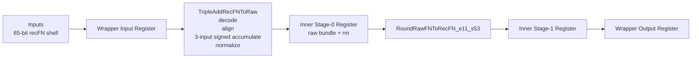
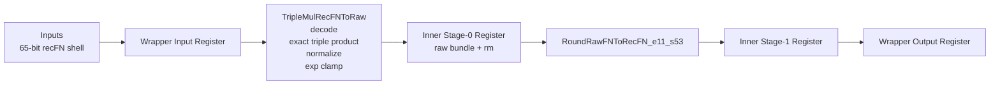
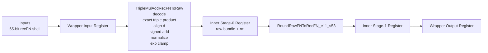

# Triple FP Units

Standalone custom floating-point units built in the BOOM / HardFloat RTL environment.

This repo contains three standalone multi-operand unit families:

- triple add: `a + b + c`
- triple multiply: `a * b * c`
- triple multiply-add: `a * b * c + d`
- single precision (`f32`)
- double precision (`f64`)

These are standalone pipelined RTL blocks. They are not integrated into BOOM decode, issue, or writeback.

## What Is In This Repo

Implemented top-level units:

- [TripleAddPipe_l4_f64.sv](./TripleAddPipe_l4_f64.sv)
- [TripleAddPipe_l4_f32.sv](./TripleAddPipe_l4_f32.sv)
- [TripleMulPipe_l4_f64.sv](./TripleMulPipe_l4_f64.sv)
- [TripleMulPipe_l4_f32.sv](./TripleMulPipe_l4_f32.sv)
- [TripleMulAddPipe_l4_f64.sv](./TripleMulAddPipe_l4_f64.sv)
- [TripleMulAddPipe_l4_f32.sv](./TripleMulAddPipe_l4_f32.sv)

Shared inner pipes:

- [TripleAddRecFNPipe_l2.sv](./TripleAddRecFNPipe_l2.sv)
- [TripleMulRecFNPipe_l2.sv](./TripleMulRecFNPipe_l2.sv)
- [TripleMulAddRecFNPipe_l2.sv](./TripleMulAddRecFNPipe_l2.sv)

Raw arithmetic cores:

- [TripleAddRecFNToRaw.sv](./TripleAddRecFNToRaw.sv)
- [TripleMulRecFNToRaw.sv](./TripleMulRecFNToRaw.sv)
- [TripleMulAddRecFNToRaw.sv](./TripleMulAddRecFNToRaw.sv)

Project navigation:

- landing page: [docs/PROJECT_SUMMARY.md](./docs/PROJECT_SUMMARY.md)
- main spec: [docs/TRIPLE_FP_UNITS_SPEC.md](./docs/TRIPLE_FP_UNITS_SPEC.md)
- design constraints: [docs/DESIGN_CONSTRAINTS.md](./docs/DESIGN_CONSTRAINTS.md)
- verification summary: [docs/OFFLINE_VERIFICATION.md](./docs/OFFLINE_VERIFICATION.md)
- diagrams page: [docs/BLOCK_DIAGRAMS.md](./docs/BLOCK_DIAGRAMS.md)
- examples: [examples/README.md](./examples/README.md)
- HardFloat provenance: [docs/HARDFLOAT_USAGE_AND_PROVENANCE.md](./docs/HARDFLOAT_USAGE_AND_PROVENANCE.md)
- bug log: [docs/BUG_REPORT_AND_FIXES.md](./docs/BUG_REPORT_AND_FIXES.md)
- command log: [docs/COMMAND_HISTORY_DUMP.md](./docs/COMMAND_HISTORY_DUMP.md)
- prompt log: [docs/PROMPT_HISTORY_DUMP.md](./docs/PROMPT_HISTORY_DUMP.md)

## Design Goals

- keep the visible interface and latency aligned with the original FMA wrapper style
- reuse the existing recFN representation and HardFloat rounders already present in the surrounding BOOM workspace
- build the arithmetic raw cores from scratch instead of chaining top-level FMA wrappers
- provide strong standalone verification
- provide readable Python reference/debug models for understanding the datapath

Detailed constraint list:

- [docs/DESIGN_CONSTRAINTS.md](./docs/DESIGN_CONSTRAINTS.md)

## Pipeline Shape

All six units follow the same visible registered structure:

1. wrapper input register
2. inner pipe stage 0 register
3. inner pipe stage 1 register
4. wrapper output register

For `f64`, the active datapath is 65-bit recFN throughout.

For `f32`, the external wrapper still uses the BOOM-style 65-bit shell, but the active recFN value is the low 33 bits inside the unit.

## Unit Summary

| Unit | Operation | Precision | External Input | Internal recFN | Rounder |
|---|---|---|---|---|---|
| `TripleAddPipe_l4_f64` | `a+b+c` | `f64` | 65-bit shell | 65-bit recFN | `RoundRawFNToRecFN_e11_s53` |
| `TripleAddPipe_l4_f32` | `a+b+c` | `f32` | 65-bit shell | low 33 bits active | `RoundRawFNToRecFN_e8_s24` |
| `TripleMulPipe_l4_f64` | `a*b*c` | `f64` | 65-bit shell | 65-bit recFN | `RoundRawFNToRecFN_e11_s53` |
| `TripleMulPipe_l4_f32` | `a*b*c` | `f32` | 65-bit shell | low 33 bits active | `RoundRawFNToRecFN_e8_s24` |
| `TripleMulAddPipe_l4_f64` | `a*b*c+d` | `f64` | 65-bit shell | 65-bit recFN | `RoundRawFNToRecFN_e11_s53` |
| `TripleMulAddPipe_l4_f32` | `a*b*c+d` | `f32` | 65-bit shell | low 33 bits active | `RoundRawFNToRecFN_e8_s24` |

## Block Diagrams

The detailed block diagrams are collected in [docs/BLOCK_DIAGRAMS.md](./docs/BLOCK_DIAGRAMS.md).

### `TripleAddPipe_l4_f64`



### `TripleMulPipe_l4_f64`



### `TripleMulAddPipe_l4_f64`



## Tool Installation

### Required tools

- `verilator`
- `python3`

Optional but useful:

- `svlint`
- `cargo`
- Questa, VCS, or Xcelium for functional coverage in `uvm_lite/`

### macOS

```sh
brew install verilator python svlint
```

### Linux

Ubuntu / Debian:

```sh
sudo apt update
sudo apt install -y build-essential git python3 python3-pip verilator
```

If you also want `svlint` on Linux:

```sh
sudo apt install -y cargo
cargo install svlint
```

## Environment Setup

This repo expects to live inside a BOOM workspace, because it reuses the existing HardFloat-generated rounders and helper RTL from the parent tree.

Typical layout:

```text
/path/to/BoomV3/
  RoundRawFNToRecFN_e11_s53.sv
  RoundRawFNToRecFN_e8_s24.sv
  ...
  triple_fp_units/
```

Set these once per shell:

```sh
export BOOMV3_ROOT=/path/to/BoomV3
export REPO_ROOT="$BOOMV3_ROOT/triple_fp_units"
cd "$REPO_ROOT"
```

## Verification

There are four useful verification levels in this repo:

1. directed standalone benches
2. deep vector replay for the triple-add and triple-multiply families
3. deep vector replay for the triple-multiply-add family
4. Python staged reference/debug models

There is also a reusable `uvm_lite/` layer for the original triple-add and triple-multiply families.

### 1. Directed standalone benches

Directed benches for the original 3-operand families:

- [tb_triple_fp_f64.sv](./tb_triple_fp_f64.sv)
- [tb_triple_fp_f32.sv](./tb_triple_fp_f32.sv)

Directed benches for the 4-operand family:

- [tb_triple_mul_add_f64.sv](./tb_triple_mul_add_f64.sv)
- [tb_triple_mul_add_f32.sv](./tb_triple_mul_add_f32.sv)

Run `f64` directed `a*b*c+d`:

```sh
verilator --binary --timing -Wall -Wno-fatal -Wno-UNUSEDSIGNAL \
  --top-module tb_triple_mul_add_f64 \
  -Mdir "$REPO_ROOT/obj_dir_quad_f64" \
  "$REPO_ROOT/tb_triple_mul_add_f64.sv" \
  "$REPO_ROOT/TripleMulAddPipe_l4_f64.sv" \
  "$REPO_ROOT/TripleMulAddRecFNPipe_l2.sv" \
  "$REPO_ROOT/TripleMulAddRecFNToRaw.sv" \
  "$BOOMV3_ROOT/INToRecFN_i64_e11_s53.sv" \
  "$BOOMV3_ROOT/RoundRawFNToRecFN_e11_s53.sv" \
  "$BOOMV3_ROOT/RoundAnyRawFNToRecFN_ie11_is55_oe11_os53.sv" \
  "$BOOMV3_ROOT/RoundAnyRawFNToRecFN_ie7_is64_oe11_os53.sv"
"$REPO_ROOT/obj_dir_quad_f64/Vtb_triple_mul_add_f64"
```

Run `f32` directed `a*b*c+d`:

```sh
verilator --binary --timing -Wall -Wno-fatal -Wno-UNUSEDSIGNAL \
  --top-module tb_triple_mul_add_f32 \
  -Mdir "$REPO_ROOT/obj_dir_quad_f32" \
  "$REPO_ROOT/tb_triple_mul_add_f32.sv" \
  "$REPO_ROOT/TripleMulAddPipe_l4_f32.sv" \
  "$REPO_ROOT/TripleMulAddRecFNPipe_l2.sv" \
  "$REPO_ROOT/TripleMulAddRecFNToRaw.sv" \
  "$BOOMV3_ROOT/INToRecFN_i64_e8_s24.sv" \
  "$BOOMV3_ROOT/RoundRawFNToRecFN_e8_s24.sv" \
  "$BOOMV3_ROOT/RoundAnyRawFNToRecFN_ie8_is26_oe8_os24.sv" \
  "$BOOMV3_ROOT/RoundAnyRawFNToRecFN_ie7_is64_oe8_os24.sv"
"$REPO_ROOT/obj_dir_quad_f32/Vtb_triple_mul_add_f32"
```

Expected results:

- `tb_triple_mul_add_f64 PASS`
- `tb_triple_mul_add_f32 PASS`

### 2. Deep vector replay for `a+b+c` and `a*b*c`

This flow uses the larger vector corpus in `verif/vectors/`, backed by Berkeley TestFloat operand streams plus the local oracle.

If you want to regenerate those vectors:

```sh
python3 "$REPO_ROOT/verif/generate_triple_fp_vectors.py" --n-per-seed 128
```

Key files:

- [verif/generate_triple_fp_vectors.py](./verif/generate_triple_fp_vectors.py)
- [verif/tb_triple_fp_random_f64.sv](./verif/tb_triple_fp_random_f64.sv)
- [verif/tb_triple_fp_random_f32.sv](./verif/tb_triple_fp_random_f32.sv)

### 3. Deep vector replay for `a*b*c+d`

This flow uses a Python-generated random vector corpus driven by the staged `triple_mul_add_*` reference models.

Regenerate vectors:

```sh
python3 "$REPO_ROOT/verif/generate_triple_mul_add_vectors.py" --n 4096
```

Run `f64` deep replay:

```sh
verilator --binary --timing -Wall -Wno-fatal -Wno-UNUSEDSIGNAL \
  --top-module tb_triple_mul_add_random_f64 \
  -Mdir "$REPO_ROOT/obj_dir_muladd_rand_f64" \
  "$REPO_ROOT/verif/tb_triple_mul_add_random_f64.sv" \
  "$REPO_ROOT/TripleMulAddPipe_l4_f64.sv" \
  "$REPO_ROOT/TripleMulAddRecFNPipe_l2.sv" \
  "$REPO_ROOT/TripleMulAddRecFNToRaw.sv" \
  "$BOOMV3_ROOT/RoundRawFNToRecFN_e11_s53.sv" \
  "$BOOMV3_ROOT/RoundAnyRawFNToRecFN_ie11_is55_oe11_os53.sv"
"$REPO_ROOT/obj_dir_muladd_rand_f64/Vtb_triple_mul_add_random_f64"
```

Run `f32` deep replay:

```sh
verilator --binary --timing -Wall -Wno-fatal -Wno-UNUSEDSIGNAL \
  --top-module tb_triple_mul_add_random_f32 \
  -Mdir "$REPO_ROOT/obj_dir_muladd_rand_f32" \
  "$REPO_ROOT/verif/tb_triple_mul_add_random_f32.sv" \
  "$REPO_ROOT/TripleMulAddPipe_l4_f32.sv" \
  "$REPO_ROOT/TripleMulAddRecFNPipe_l2.sv" \
  "$REPO_ROOT/TripleMulAddRecFNToRaw.sv" \
  "$BOOMV3_ROOT/RoundRawFNToRecFN_e8_s24.sv" \
  "$BOOMV3_ROOT/RoundAnyRawFNToRecFN_ie8_is26_oe8_os24.sv"
"$REPO_ROOT/obj_dir_muladd_rand_f32/Vtb_triple_mul_add_random_f32"
```

Key files:

- [verif/generate_triple_mul_add_vectors.py](./verif/generate_triple_mul_add_vectors.py)
- [verif/tb_triple_mul_add_random_f64.sv](./verif/tb_triple_mul_add_random_f64.sv)
- [verif/tb_triple_mul_add_random_f32.sv](./verif/tb_triple_mul_add_random_f32.sv)

### 4. Python staged reference/debug models

Triple add, `f64`:

```sh
python3 "$REPO_ROOT/python_reference_models/run_reference_model.py" \
  --unit triple_add_f64 \
  --input-format ieee \
  --rm rne \
  --a 0x3ff0000000000000 \
  --b 0x4000000000000000 \
  --c 0x4008000000000000
```

Triple multiply, `f64`:

```sh
python3 "$REPO_ROOT/python_reference_models/run_reference_model.py" \
  --unit triple_mul_f64 \
  --input-format ieee \
  --rm rne \
  --a 0x3ff0000000000000 \
  --b 0x4000000000000000 \
  --c 0x4008000000000000
```

Triple multiply-add, `f64`:

```sh
python3 "$REPO_ROOT/python_reference_models/run_reference_model.py" \
  --unit triple_mul_add_f64 \
  --input-format ieee \
  --rm rne \
  --a 0x3ff0000000000000 \
  --b 0x4000000000000000 \
  --c 0x4008000000000000 \
  --d 0x4010000000000000
```

Python sanity checks:

```sh
python3 "$REPO_ROOT/python_reference_models/test_reference_models.py"
```

## How To Verify Each Implementation

### `TripleAddPipe_l4_f64`

- directed `f64` bench: [tb_triple_fp_f64.sv](./tb_triple_fp_f64.sv)
- deep `f64` replay: [verif/tb_triple_fp_random_f64.sv](./verif/tb_triple_fp_random_f64.sv)
- `uvm_lite` `f64`: [uvm_lite/tb_triple_fp_uvm_lite_f64.sv](./uvm_lite/tb_triple_fp_uvm_lite_f64.sv)
- Python model: `--unit triple_add_f64`

### `TripleMulPipe_l4_f64`

- directed `f64` bench: [tb_triple_fp_f64.sv](./tb_triple_fp_f64.sv)
- deep `f64` replay: [verif/tb_triple_fp_random_f64.sv](./verif/tb_triple_fp_random_f64.sv)
- `uvm_lite` `f64`: [uvm_lite/tb_triple_fp_uvm_lite_f64.sv](./uvm_lite/tb_triple_fp_uvm_lite_f64.sv)
- Python model: `--unit triple_mul_f64`

### `TripleMulAddPipe_l4_f64`

- directed `f64` bench: [tb_triple_mul_add_f64.sv](./tb_triple_mul_add_f64.sv)
- deep `f64` replay: [verif/tb_triple_mul_add_random_f64.sv](./verif/tb_triple_mul_add_random_f64.sv)
- Python model: `--unit triple_mul_add_f64`

### `TripleAddPipe_l4_f32`

- directed `f32` bench: [tb_triple_fp_f32.sv](./tb_triple_fp_f32.sv)
- deep `f32` replay: [verif/tb_triple_fp_random_f32.sv](./verif/tb_triple_fp_random_f32.sv)
- `uvm_lite` `f32`: [uvm_lite/tb_triple_fp_uvm_lite_f32.sv](./uvm_lite/tb_triple_fp_uvm_lite_f32.sv)
- Python model: `--unit triple_add_f32`

### `TripleMulPipe_l4_f32`

- directed `f32` bench: [tb_triple_fp_f32.sv](./tb_triple_fp_f32.sv)
- deep `f32` replay: [verif/tb_triple_fp_random_f32.sv](./verif/tb_triple_fp_random_f32.sv)
- `uvm_lite` `f32`: [uvm_lite/tb_triple_fp_uvm_lite_f32.sv](./uvm_lite/tb_triple_fp_uvm_lite_f32.sv)
- Python model: `--unit triple_mul_f32`

### `TripleMulAddPipe_l4_f32`

- directed `f32` bench: [tb_triple_mul_add_f32.sv](./tb_triple_mul_add_f32.sv)
- deep `f32` replay: [verif/tb_triple_mul_add_random_f32.sv](./verif/tb_triple_mul_add_random_f32.sv)
- Python model: `--unit triple_mul_add_f32`

## Python Reference Models

The Python reference/debug models are for understanding the format and following each stage in software:

- [python_reference_models/README.md](./python_reference_models/README.md)
- [python_reference_models/triple_fp_reference_lib.py](./python_reference_models/triple_fp_reference_lib.py)
- [python_reference_models/run_reference_model.py](./python_reference_models/run_reference_model.py)
- [python_reference_models/test_reference_models.py](./python_reference_models/test_reference_models.py)

They provide:

- recFN decode and class breakdown
- stage-by-stage debug snapshots
- software-equivalent output and exception flags
- sampled validation against the vector corpus

## Quick Start

Run the existing structured replay flow for the original 3-operand families:

```sh
"$REPO_ROOT/uvm_lite/run_uvm_lite_verilator.sh" all
```

Run the new `a*b*c+d` vector generator:

```sh
python3 "$REPO_ROOT/verif/generate_triple_mul_add_vectors.py" --n 4096
```

Run the Python reference model on one `a*b*c+d` case:

```sh
python3 "$REPO_ROOT/python_reference_models/run_reference_model.py" \
  --unit triple_mul_add_f64 \
  --input-format ieee \
  --rm rne \
  --a 0x3ff0000000000000 \
  --b 0x4000000000000000 \
  --c 0x4008000000000000 \
  --d 0x4010000000000000
```

## Examples

Worked examples and command snippets live here:

- [examples/README.md](./examples/README.md)
- [examples/quickstart_commands.sh](./examples/quickstart_commands.sh)
- [examples/STAGE_BY_STAGE_EXAMPLES.txt](./examples/STAGE_BY_STAGE_EXAMPLES.txt)
- [examples/RANDOM_STAGE_BY_STAGE_EXAMPLES.txt](./examples/RANDOM_STAGE_BY_STAGE_EXAMPLES.txt)

## External References

This project sits on top of the BOOM / Chipyard / HardFloat ecosystem. Helpful official references are:

- Chipyard repository: [ucb-bar/chipyard](https://github.com/ucb-bar/chipyard)
- Chipyard docs: [chipyard.readthedocs.io](https://chipyard.readthedocs.io/)
- BOOM repository: [riscv-boom/riscv-boom](https://github.com/riscv-boom/riscv-boom)
- BOOM docs and publications: [boom-core.org](https://boom-core.org/)
- Berkeley HardFloat repository mirror used in this project: [ucb-bar/berkeley-hardfloat](https://github.com/ucb-bar/berkeley-hardfloat)
- Official Berkeley HardFloat overview: [jhauser.us/arithmetic/HardFloat.html](https://www.jhauser.us/arithmetic/HardFloat.html)
- HardFloat Verilog module documentation: [HardFloat-Verilog.html](https://www.jhauser.us/arithmetic/HardFloat-1/doc/HardFloat-Verilog.html)

Recommended citation style taken from project-maintained sources:

- Chipyard: cite the IEEE Micro 2020 Chipyard paper by Amid et al. as recommended in the Chipyard README.
- BOOM / SonicBOOM: cite the SonicBOOM 2020 CARRV workshop paper by Zhao et al. as recommended in the BOOM README.
- HardFloat: this repo references HardFloat using the official Berkeley HardFloat documentation by John R. Hauser and the project/release pages.

For project-specific provenance details, see:

- [docs/HARDFLOAT_USAGE_AND_PROVENANCE.md](./docs/HARDFLOAT_USAGE_AND_PROVENANCE.md)

## Recommended Reading Paths

If you want to understand the architecture first:

1. [README.md](./README.md)
2. [docs/BLOCK_DIAGRAMS.md](./docs/BLOCK_DIAGRAMS.md)
3. [docs/TRIPLE_FP_UNITS_SPEC.md](./docs/TRIPLE_FP_UNITS_SPEC.md)

If you want the raw cores first:

1. [TripleAddRecFNToRaw.sv](./TripleAddRecFNToRaw.sv)
2. [TripleMulRecFNToRaw.sv](./TripleMulRecFNToRaw.sv)
3. [TripleMulAddRecFNToRaw.sv](./TripleMulAddRecFNToRaw.sv)

If you want verification first:

1. [docs/OFFLINE_VERIFICATION.md](./docs/OFFLINE_VERIFICATION.md)
2. [verif/README.md](./verif/README.md)
3. [uvm_lite/README.md](./uvm_lite/README.md)

If you want the software model first:

1. [python_reference_models/README.md](./python_reference_models/README.md)
2. [python_reference_models/run_reference_model.py](./python_reference_models/run_reference_model.py)
3. [python_reference_models/triple_fp_reference_lib.py](./python_reference_models/triple_fp_reference_lib.py)

If you want the audit trail:

1. [docs/BUG_REPORT_AND_FIXES.md](./docs/BUG_REPORT_AND_FIXES.md)
2. [docs/COMMAND_HISTORY_DUMP.md](./docs/COMMAND_HISTORY_DUMP.md)
3. [docs/PROMPT_HISTORY_DUMP.md](./docs/PROMPT_HISTORY_DUMP.md)

## Current Project Status

As it stands, the standalone project includes:

- implemented RTL for six units
- pipeline-stage alignment with the original FMA wrapper style
- directed benches for all units
- deep vector replay for the original triple-add and triple-multiply families
- Python-backed deep vector replay for the triple-multiply-add family
- a reusable `uvm_lite/` layer for the original triple-add and triple-multiply families
- Python staged reference/debug models for all units
