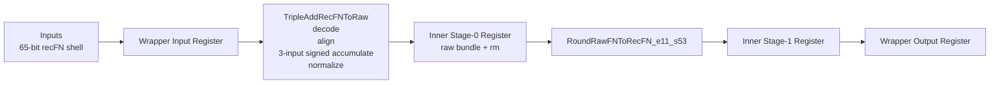
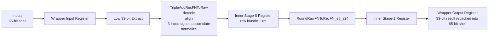
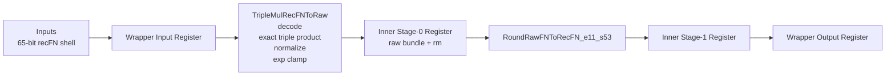
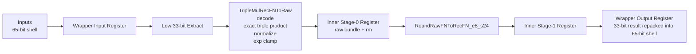
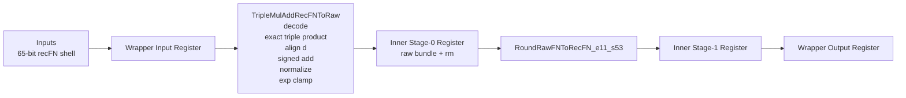
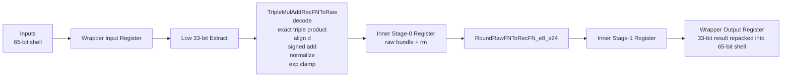

# Triple FP Units

Standalone custom floating-point units built in the BOOM/HardFloat RTL environment.

This repo now contains two 3-operand families and one 4-operand family:

- triple add: `a + b + c`
- triple multiply: `a * b * c`
- triple multiply-add: `a * b * c + d`
- single precision (`f32`)
- double precision (`f64`)

These are standalone pipelined RTL blocks. They are not integrated into BOOM decode, issue, or writeback.

## What Is In This Repo

Implemented top-level units:

- [TripleAddPipe_l4_f64.sv](/Users/kvsaiakhil/Projects/BoomV3/triple_fp_units/TripleAddPipe_l4_f64.sv)
- [TripleAddPipe_l4_f32.sv](/Users/kvsaiakhil/Projects/BoomV3/triple_fp_units/TripleAddPipe_l4_f32.sv)
- [TripleMulPipe_l4_f64.sv](/Users/kvsaiakhil/Projects/BoomV3/triple_fp_units/TripleMulPipe_l4_f64.sv)
- [TripleMulPipe_l4_f32.sv](/Users/kvsaiakhil/Projects/BoomV3/triple_fp_units/TripleMulPipe_l4_f32.sv)
- [TripleMulAddPipe_l4_f64.sv](/Users/kvsaiakhil/Projects/BoomV3/triple_fp_units/TripleMulAddPipe_l4_f64.sv)
- [TripleMulAddPipe_l4_f32.sv](/Users/kvsaiakhil/Projects/BoomV3/triple_fp_units/TripleMulAddPipe_l4_f32.sv)

Shared inner pipes:

- [TripleAddRecFNPipe_l2.sv](/Users/kvsaiakhil/Projects/BoomV3/triple_fp_units/TripleAddRecFNPipe_l2.sv)
- [TripleMulRecFNPipe_l2.sv](/Users/kvsaiakhil/Projects/BoomV3/triple_fp_units/TripleMulRecFNPipe_l2.sv)
- [TripleMulAddRecFNPipe_l2.sv](/Users/kvsaiakhil/Projects/BoomV3/triple_fp_units/TripleMulAddRecFNPipe_l2.sv)

Raw arithmetic cores:

- [TripleAddRecFNToRaw.sv](/Users/kvsaiakhil/Projects/BoomV3/triple_fp_units/TripleAddRecFNToRaw.sv)
- [TripleMulRecFNToRaw.sv](/Users/kvsaiakhil/Projects/BoomV3/triple_fp_units/TripleMulRecFNToRaw.sv)
- [TripleMulAddRecFNToRaw.sv](/Users/kvsaiakhil/Projects/BoomV3/triple_fp_units/TripleMulAddRecFNToRaw.sv)

Project navigation:

- landing page: [PROJECT_SUMMARY.md](/Users/kvsaiakhil/Projects/BoomV3/triple_fp_units/docs/PROJECT_SUMMARY.md)
- main spec: [TRIPLE_FP_UNITS_SPEC.md](/Users/kvsaiakhil/Projects/BoomV3/triple_fp_units/docs/TRIPLE_FP_UNITS_SPEC.md)
- verification summary: [OFFLINE_VERIFICATION.md](/Users/kvsaiakhil/Projects/BoomV3/triple_fp_units/docs/OFFLINE_VERIFICATION.md)
- diagrams page: [BLOCK_DIAGRAMS.md](/Users/kvsaiakhil/Projects/BoomV3/triple_fp_units/docs/BLOCK_DIAGRAMS.md)
- bug log: [BUG_REPORT_AND_FIXES.md](/Users/kvsaiakhil/Projects/BoomV3/triple_fp_units/docs/BUG_REPORT_AND_FIXES.md)
- command log: [COMMAND_HISTORY_DUMP.md](/Users/kvsaiakhil/Projects/BoomV3/triple_fp_units/docs/COMMAND_HISTORY_DUMP.md)
- prompt log: [PROMPT_HISTORY_DUMP.md](/Users/kvsaiakhil/Projects/BoomV3/triple_fp_units/docs/PROMPT_HISTORY_DUMP.md)

## Design Goals

- keep the visible interface and latency aligned with the original FMA wrapper style
- reuse the existing recFN representation and HardFloat rounders already present in the BOOM/Chipyard RTL tree
- build the arithmetic raw cores from scratch instead of chaining top-level FMA wrappers
- provide strong standalone verification
- provide readable Python reference/debug models for understanding the datapath

## Pipeline Shape

All six units follow the same visible registered structure:

1. wrapper input register
2. inner pipe stage 0 register
3. inner pipe stage 1 register
4. wrapper output register

For `f64`, the active datapath is 65-bit recFN throughout.

For `f32`, the external wrapper still uses the BOOM-style 65-bit shell, but the active recFN value is the low 33 bits inside the unit.

## Unit Summary

| Unit | Operation | Precision | External Input | Internal recFN | Rounder |
|---|---|---|---|---|---|
| `TripleAddPipe_l4_f64` | `a+b+c` | `f64` | 65-bit shell | 65-bit recFN | `RoundRawFNToRecFN_e11_s53` |
| `TripleAddPipe_l4_f32` | `a+b+c` | `f32` | 65-bit shell | low 33 bits active | `RoundRawFNToRecFN_e8_s24` |
| `TripleMulPipe_l4_f64` | `a*b*c` | `f64` | 65-bit shell | 65-bit recFN | `RoundRawFNToRecFN_e11_s53` |
| `TripleMulPipe_l4_f32` | `a*b*c` | `f32` | 65-bit shell | low 33 bits active | `RoundRawFNToRecFN_e8_s24` |
| `TripleMulAddPipe_l4_f64` | `a*b*c+d` | `f64` | 65-bit shell | 65-bit recFN | `RoundRawFNToRecFN_e11_s53` |
| `TripleMulAddPipe_l4_f32` | `a*b*c+d` | `f32` | 65-bit shell | low 33 bits active | `RoundRawFNToRecFN_e8_s24` |

## Block Diagrams

### `TripleAddPipe_l4_f64`



### `TripleAddPipe_l4_f32`



### `TripleMulPipe_l4_f64`



### `TripleMulPipe_l4_f32`



### `TripleMulAddPipe_l4_f64`



### `TripleMulAddPipe_l4_f32`



## Arithmetic Breakdown

### Triple add path

The add units perform:

1. recFN operand classification
2. special-case handling for NaN, infinity, and zero
3. finite exponent alignment using the minimum recoded exponent
4. 3-input signed accumulation in a wide exact accumulator
5. raw normalization into the HardFloat rounder contract
6. final rounding and recFN packing

### Triple multiply path

The multiply units perform:

1. recFN operand classification
2. special-case handling for NaN, infinity, zero, and `inf * 0`
3. hidden-bit significand formation
4. exact 3-input significand product
5. recoded-exponent accumulation
6. raw normalization and exponent clamp
7. final rounding and recFN packing

### Triple multiply-add path

The multiply-add units perform:

1. recFN operand classification for `a`, `b`, `c`, and `d`
2. product-side special-case handling for `inf * 0`
3. exact triple-product formation for `a*b*c`
4. addend alignment for `d`
5. signed accumulation of `product` and `d`
6. raw normalization and exponent clamp
7. final rounding and recFN packing

## Tool Installation

### Required local tools

For the verification flows used in this project, install:

- `verilator`
- `svlint`
- `python3`

On macOS with Homebrew:

```sh
brew install verilator svlint python
```

### Optional tools

- `iverilog`
  useful for alternate lightweight simulation
- Questa, VCS, or Xcelium
  useful if you want functional coverage collection from the `uvm_lite/` environment

## Environment Setup

The commands below assume your BOOM workspace is:

```sh
/Users/kvsaiakhil/Projects/BoomV3
```

The subproject root is:

```sh
/Users/kvsaiakhil/Projects/BoomV3/triple_fp_units
```

For convenience:

```sh
cd /Users/kvsaiakhil/Projects/BoomV3/triple_fp_units
```

## Verification

There are four useful verification levels in this repo:

1. directed standalone benches
2. deep vector replay for the triple-add and triple-multiply families
3. deep vector replay for the triple-multiply-add family
4. Python staged reference/debug models

There is also a reusable `uvm_lite/` layer for the original triple-add and triple-multiply families.

### 1. Directed standalone benches

Directed benches for the original 3-operand families:

- [tb_triple_fp_f64.sv](/Users/kvsaiakhil/Projects/BoomV3/triple_fp_units/tb_triple_fp_f64.sv)
- [tb_triple_fp_f32.sv](/Users/kvsaiakhil/Projects/BoomV3/triple_fp_units/tb_triple_fp_f32.sv)

Directed benches for the 4-operand family:

- [tb_triple_mul_add_f64.sv](/Users/kvsaiakhil/Projects/BoomV3/triple_fp_units/tb_triple_mul_add_f64.sv)
- [tb_triple_mul_add_f32.sv](/Users/kvsaiakhil/Projects/BoomV3/triple_fp_units/tb_triple_mul_add_f32.sv)

Run `f64` directed `a*b*c+d`:

```sh
verilator --binary --timing -Wall -Wno-fatal -Wno-UNUSEDSIGNAL \
  --top-module tb_triple_mul_add_f64 \
  -Mdir /Users/kvsaiakhil/Projects/BoomV3/triple_fp_units/obj_dir_quad_f64 \
  /Users/kvsaiakhil/Projects/BoomV3/triple_fp_units/tb_triple_mul_add_f64.sv \
  /Users/kvsaiakhil/Projects/BoomV3/triple_fp_units/TripleMulAddPipe_l4_f64.sv \
  /Users/kvsaiakhil/Projects/BoomV3/triple_fp_units/TripleMulAddRecFNPipe_l2.sv \
  /Users/kvsaiakhil/Projects/BoomV3/triple_fp_units/TripleMulAddRecFNToRaw.sv \
  /Users/kvsaiakhil/Projects/BoomV3/INToRecFN_i64_e11_s53.sv \
  /Users/kvsaiakhil/Projects/BoomV3/RoundRawFNToRecFN_e11_s53.sv \
  /Users/kvsaiakhil/Projects/BoomV3/RoundAnyRawFNToRecFN_ie11_is55_oe11_os53.sv \
  /Users/kvsaiakhil/Projects/BoomV3/RoundAnyRawFNToRecFN_ie7_is64_oe11_os53.sv
/Users/kvsaiakhil/Projects/BoomV3/triple_fp_units/obj_dir_quad_f64/Vtb_triple_mul_add_f64
```

Expected result:

- `tb_triple_mul_add_f64 PASS`

Run `f32` directed `a*b*c+d`:

```sh
verilator --binary --timing -Wall -Wno-fatal -Wno-UNUSEDSIGNAL \
  --top-module tb_triple_mul_add_f32 \
  -Mdir /Users/kvsaiakhil/Projects/BoomV3/triple_fp_units/obj_dir_quad_f32 \
  /Users/kvsaiakhil/Projects/BoomV3/triple_fp_units/tb_triple_mul_add_f32.sv \
  /Users/kvsaiakhil/Projects/BoomV3/triple_fp_units/TripleMulAddPipe_l4_f32.sv \
  /Users/kvsaiakhil/Projects/BoomV3/triple_fp_units/TripleMulAddRecFNPipe_l2.sv \
  /Users/kvsaiakhil/Projects/BoomV3/triple_fp_units/TripleMulAddRecFNToRaw.sv \
  /Users/kvsaiakhil/Projects/BoomV3/INToRecFN_i64_e8_s24.sv \
  /Users/kvsaiakhil/Projects/BoomV3/RoundRawFNToRecFN_e8_s24.sv \
  /Users/kvsaiakhil/Projects/BoomV3/RoundAnyRawFNToRecFN_ie8_is26_oe8_os24.sv \
  /Users/kvsaiakhil/Projects/BoomV3/RoundAnyRawFNToRecFN_ie7_is64_oe8_os24.sv
/Users/kvsaiakhil/Projects/BoomV3/triple_fp_units/obj_dir_quad_f32/Vtb_triple_mul_add_f32
```

Expected result:

- `tb_triple_mul_add_f32 PASS`

### 2. Deep vector replay for `a+b+c` and `a*b*c`

This flow uses the larger vector corpus in `verif/vectors/`, backed by Berkeley TestFloat operand streams plus the local oracle.

If you want to regenerate those vectors:

```sh
python3 /Users/kvsaiakhil/Projects/BoomV3/triple_fp_units/verif/generate_triple_fp_vectors.py --n-per-seed 128
```

Key files:

- [verif/generate_triple_fp_vectors.py](/Users/kvsaiakhil/Projects/BoomV3/triple_fp_units/verif/generate_triple_fp_vectors.py)
- [verif/tb_triple_fp_random_f64.sv](/Users/kvsaiakhil/Projects/BoomV3/triple_fp_units/verif/tb_triple_fp_random_f64.sv)
- [verif/tb_triple_fp_random_f32.sv](/Users/kvsaiakhil/Projects/BoomV3/triple_fp_units/verif/tb_triple_fp_random_f32.sv)

### 3. Deep vector replay for `a*b*c+d`

This flow uses a Python-generated random vector corpus driven by the staged `triple_mul_add_*` reference models.

Regenerate vectors:

```sh
python3 /Users/kvsaiakhil/Projects/BoomV3/triple_fp_units/verif/generate_triple_mul_add_vectors.py --n 4096
```

Run `f64` deep replay:

```sh
verilator --binary --timing -Wall -Wno-fatal -Wno-UNUSEDSIGNAL \
  --top-module tb_triple_mul_add_random_f64 \
  -Mdir /Users/kvsaiakhil/Projects/BoomV3/triple_fp_units/obj_dir_muladd_rand_f64 \
  /Users/kvsaiakhil/Projects/BoomV3/triple_fp_units/verif/tb_triple_mul_add_random_f64.sv \
  /Users/kvsaiakhil/Projects/BoomV3/triple_fp_units/TripleMulAddPipe_l4_f64.sv \
  /Users/kvsaiakhil/Projects/BoomV3/triple_fp_units/TripleMulAddRecFNPipe_l2.sv \
  /Users/kvsaiakhil/Projects/BoomV3/triple_fp_units/TripleMulAddRecFNToRaw.sv \
  /Users/kvsaiakhil/Projects/BoomV3/RoundRawFNToRecFN_e11_s53.sv \
  /Users/kvsaiakhil/Projects/BoomV3/RoundAnyRawFNToRecFN_ie11_is55_oe11_os53.sv
/Users/kvsaiakhil/Projects/BoomV3/triple_fp_units/obj_dir_muladd_rand_f64/Vtb_triple_mul_add_random_f64
```

Run `f32` deep replay:

```sh
verilator --binary --timing -Wall -Wno-fatal -Wno-UNUSEDSIGNAL \
  --top-module tb_triple_mul_add_random_f32 \
  -Mdir /Users/kvsaiakhil/Projects/BoomV3/triple_fp_units/obj_dir_muladd_rand_f32 \
  /Users/kvsaiakhil/Projects/BoomV3/triple_fp_units/verif/tb_triple_mul_add_random_f32.sv \
  /Users/kvsaiakhil/Projects/BoomV3/triple_fp_units/TripleMulAddPipe_l4_f32.sv \
  /Users/kvsaiakhil/Projects/BoomV3/triple_fp_units/TripleMulAddRecFNPipe_l2.sv \
  /Users/kvsaiakhil/Projects/BoomV3/triple_fp_units/TripleMulAddRecFNToRaw.sv \
  /Users/kvsaiakhil/Projects/BoomV3/RoundRawFNToRecFN_e8_s24.sv \
  /Users/kvsaiakhil/Projects/BoomV3/RoundAnyRawFNToRecFN_ie8_is26_oe8_os24.sv
/Users/kvsaiakhil/Projects/BoomV3/triple_fp_units/obj_dir_muladd_rand_f32/Vtb_triple_mul_add_random_f32
```

Key files:

- [verif/generate_triple_mul_add_vectors.py](/Users/kvsaiakhil/Projects/BoomV3/triple_fp_units/verif/generate_triple_mul_add_vectors.py)
- [verif/tb_triple_mul_add_random_f64.sv](/Users/kvsaiakhil/Projects/BoomV3/triple_fp_units/verif/tb_triple_mul_add_random_f64.sv)
- [verif/tb_triple_mul_add_random_f32.sv](/Users/kvsaiakhil/Projects/BoomV3/triple_fp_units/verif/tb_triple_mul_add_random_f32.sv)

### 4. Python staged reference/debug models

These models are best for understanding each unit rather than replacing RTL simulation.

Triple add, `f64`:

```sh
python3 /Users/kvsaiakhil/Projects/BoomV3/triple_fp_units/python_reference_models/run_reference_model.py \
  --unit triple_add_f64 \
  --input-format ieee \
  --rm rne \
  --a 0x3ff0000000000000 \
  --b 0x4000000000000000 \
  --c 0x4008000000000000
```

Triple multiply, `f64`:

```sh
python3 /Users/kvsaiakhil/Projects/BoomV3/triple_fp_units/python_reference_models/run_reference_model.py \
  --unit triple_mul_f64 \
  --input-format ieee \
  --rm rne \
  --a 0x3ff0000000000000 \
  --b 0x4000000000000000 \
  --c 0x4008000000000000
```

Triple multiply-add, `f64`:

```sh
python3 /Users/kvsaiakhil/Projects/BoomV3/triple_fp_units/python_reference_models/run_reference_model.py \
  --unit triple_mul_add_f64 \
  --input-format ieee \
  --rm rne \
  --a 0x3ff0000000000000 \
  --b 0x4000000000000000 \
  --c 0x4008000000000000 \
  --d 0x4010000000000000
```

Python sanity checks:

```sh
python3 /Users/kvsaiakhil/Projects/BoomV3/triple_fp_units/python_reference_models/test_reference_models.py
```

## How To Verify Each Implementation

### `TripleAddPipe_l4_f64`

- directed `f64` bench: [tb_triple_fp_f64.sv](/Users/kvsaiakhil/Projects/BoomV3/triple_fp_units/tb_triple_fp_f64.sv)
- deep `f64` replay: [verif/tb_triple_fp_random_f64.sv](/Users/kvsaiakhil/Projects/BoomV3/triple_fp_units/verif/tb_triple_fp_random_f64.sv)
- `uvm_lite` `f64`: [uvm_lite/tb_triple_fp_uvm_lite_f64.sv](/Users/kvsaiakhil/Projects/BoomV3/triple_fp_units/uvm_lite/tb_triple_fp_uvm_lite_f64.sv)
- Python model: `--unit triple_add_f64`

### `TripleMulPipe_l4_f64`

- directed `f64` bench: [tb_triple_fp_f64.sv](/Users/kvsaiakhil/Projects/BoomV3/triple_fp_units/tb_triple_fp_f64.sv)
- deep `f64` replay: [verif/tb_triple_fp_random_f64.sv](/Users/kvsaiakhil/Projects/BoomV3/triple_fp_units/verif/tb_triple_fp_random_f64.sv)
- `uvm_lite` `f64`: [uvm_lite/tb_triple_fp_uvm_lite_f64.sv](/Users/kvsaiakhil/Projects/BoomV3/triple_fp_units/uvm_lite/tb_triple_fp_uvm_lite_f64.sv)
- Python model: `--unit triple_mul_f64`

### `TripleMulAddPipe_l4_f64`

- directed `f64` bench: [tb_triple_mul_add_f64.sv](/Users/kvsaiakhil/Projects/BoomV3/triple_fp_units/tb_triple_mul_add_f64.sv)
- deep `f64` replay: [verif/tb_triple_mul_add_random_f64.sv](/Users/kvsaiakhil/Projects/BoomV3/triple_fp_units/verif/tb_triple_mul_add_random_f64.sv)
- Python model: `--unit triple_mul_add_f64`

### `TripleAddPipe_l4_f32`

- directed `f32` bench: [tb_triple_fp_f32.sv](/Users/kvsaiakhil/Projects/BoomV3/triple_fp_units/tb_triple_fp_f32.sv)
- deep `f32` replay: [verif/tb_triple_fp_random_f32.sv](/Users/kvsaiakhil/Projects/BoomV3/triple_fp_units/verif/tb_triple_fp_random_f32.sv)
- `uvm_lite` `f32`: [uvm_lite/tb_triple_fp_uvm_lite_f32.sv](/Users/kvsaiakhil/Projects/BoomV3/triple_fp_units/uvm_lite/tb_triple_fp_uvm_lite_f32.sv)
- Python model: `--unit triple_add_f32`

### `TripleMulPipe_l4_f32`

- directed `f32` bench: [tb_triple_fp_f32.sv](/Users/kvsaiakhil/Projects/BoomV3/triple_fp_units/tb_triple_fp_f32.sv)
- deep `f32` replay: [verif/tb_triple_fp_random_f32.sv](/Users/kvsaiakhil/Projects/BoomV3/triple_fp_units/verif/tb_triple_fp_random_f32.sv)
- `uvm_lite` `f32`: [uvm_lite/tb_triple_fp_uvm_lite_f32.sv](/Users/kvsaiakhil/Projects/BoomV3/triple_fp_units/uvm_lite/tb_triple_fp_uvm_lite_f32.sv)
- Python model: `--unit triple_mul_f32`

### `TripleMulAddPipe_l4_f32`

- directed `f32` bench: [tb_triple_mul_add_f32.sv](/Users/kvsaiakhil/Projects/BoomV3/triple_fp_units/tb_triple_mul_add_f32.sv)
- deep `f32` replay: [verif/tb_triple_mul_add_random_f32.sv](/Users/kvsaiakhil/Projects/BoomV3/triple_fp_units/verif/tb_triple_mul_add_random_f32.sv)
- Python model: `--unit triple_mul_add_f32`

## Python Reference Models

The Python reference/debug models are for understanding the format and following each stage in software:

- [python_reference_models/README.md](/Users/kvsaiakhil/Projects/BoomV3/triple_fp_units/python_reference_models/README.md)
- [python_reference_models/triple_fp_reference_lib.py](/Users/kvsaiakhil/Projects/BoomV3/triple_fp_units/python_reference_models/triple_fp_reference_lib.py)
- [python_reference_models/run_reference_model.py](/Users/kvsaiakhil/Projects/BoomV3/triple_fp_units/python_reference_models/run_reference_model.py)
- [python_reference_models/test_reference_models.py](/Users/kvsaiakhil/Projects/BoomV3/triple_fp_units/python_reference_models/test_reference_models.py)

They provide:

- recFN decode and class breakdown
- stage-by-stage debug snapshots
- software-equivalent output and exception flags
- sampled validation against the vector corpus

## Quick Start

Run the existing structured replay flow for the original 3-operand families:

```sh
/Users/kvsaiakhil/Projects/BoomV3/triple_fp_units/uvm_lite/run_uvm_lite_verilator.sh all
```

Run the new `a*b*c+d` vector generator:

```sh
python3 /Users/kvsaiakhil/Projects/BoomV3/triple_fp_units/verif/generate_triple_mul_add_vectors.py --n 4096
```

Run the Python reference model on one `a*b*c+d` case:

```sh
python3 /Users/kvsaiakhil/Projects/BoomV3/triple_fp_units/python_reference_models/run_reference_model.py \
  --unit triple_mul_add_f64 \
  --input-format ieee \
  --rm rne \
  --a 0x3ff0000000000000 \
  --b 0x4000000000000000 \
  --c 0x4008000000000000 \
  --d 0x4010000000000000
```

## Best Entry Points

If you want a quick project overview:

1. [PROJECT_SUMMARY.md](/Users/kvsaiakhil/Projects/BoomV3/triple_fp_units/docs/PROJECT_SUMMARY.md)
2. [BLOCK_DIAGRAMS.md](/Users/kvsaiakhil/Projects/BoomV3/triple_fp_units/docs/BLOCK_DIAGRAMS.md)
3. [TRIPLE_FP_UNITS_SPEC.md](/Users/kvsaiakhil/Projects/BoomV3/triple_fp_units/docs/TRIPLE_FP_UNITS_SPEC.md)

If you want the implementation first:

1. [TripleAddRecFNToRaw.sv](/Users/kvsaiakhil/Projects/BoomV3/triple_fp_units/TripleAddRecFNToRaw.sv)
2. [TripleMulRecFNToRaw.sv](/Users/kvsaiakhil/Projects/BoomV3/triple_fp_units/TripleMulRecFNToRaw.sv)
3. [TripleMulAddRecFNToRaw.sv](/Users/kvsaiakhil/Projects/BoomV3/triple_fp_units/TripleMulAddRecFNToRaw.sv)

If you want the software model first:

1. [python_reference_models/README.md](/Users/kvsaiakhil/Projects/BoomV3/triple_fp_units/python_reference_models/README.md)
2. [python_reference_models/run_reference_model.py](/Users/kvsaiakhil/Projects/BoomV3/triple_fp_units/python_reference_models/run_reference_model.py)
3. [python_reference_models/triple_fp_reference_lib.py](/Users/kvsaiakhil/Projects/BoomV3/triple_fp_units/python_reference_models/triple_fp_reference_lib.py)

If you want the project audit trail:

1. [BUG_REPORT_AND_FIXES.md](/Users/kvsaiakhil/Projects/BoomV3/triple_fp_units/docs/BUG_REPORT_AND_FIXES.md)
2. [COMMAND_HISTORY_DUMP.md](/Users/kvsaiakhil/Projects/BoomV3/triple_fp_units/docs/COMMAND_HISTORY_DUMP.md)
3. [PROMPT_HISTORY_DUMP.md](/Users/kvsaiakhil/Projects/BoomV3/triple_fp_units/docs/PROMPT_HISTORY_DUMP.md)
